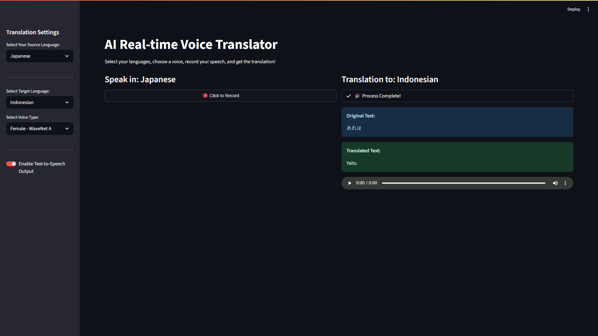

# 🎤 AI Real-time Voice Translator


An interactive web application designed to break down language barriers in real-time conversations. Built with Streamlit and containerized with Docker, this app leverages Google Cloud's powerful AI services to provide a seamless translation experience for interviews, meetings, and global collaboration.

<p align="center">
  
  
</p>

---

## 🎯 The Real-World Problem This Solves

In our increasingly globalized world, language differences remain a significant barrier in professional settings. This is especially true during:
- **International Job Interviews:** Talented candidates may struggle to express their true expertise when an interview is not in their native language.
- **Global Team Meetings:** Collaboration and brainstorming can be slow and inefficient when participants are not fluent in a common language.
- **Client & Partner Calls:** Building rapport and negotiating effectively is difficult when nuance and intent are "lost in translation."

This application directly addresses these challenges by providing a personal, real-time "interpreter," empowering users to communicate clearly and confidently, regardless of language barriers.

---

## ✨ Key Features

- **Real-time Voice Translation:** Record your voice directly in the browser and get instant results.
- **Multi-Language Support:**
  - Select from a wide range of **source languages** to speak in.
  - Choose from an extensive list of **target languages** for translation.
- **Dynamic Voice Selection:** Customize the translated audio by choosing between different voice types (e.g., Male/Female, WaveNet/Standard).
- **Auto-play Audio:** The translated voice output plays automatically for a fluid user experience.
- **Cost & Speed Optimization:** A toggle switch allows you to disable the Text-to-Speech service, providing text-only translations to save on API costs and reduce latency.
- **Interactive UI:** A clean and user-friendly interface built with Streamlit, featuring real-time status updates during processing.
- **Containerized & Portable:** Fully containerized with Docker and managed by Docker Compose for easy, one-command setup on any machine.

---

## 💡 Usage Scenarios

This tool is designed to be flexible. Here’s how you can use it for effective communication.

### **Scenario 1: One-Way Presentation (e.g., An Interview)**

This is the primary use case. You are User A, and you need to speak in a language you are not fluent in.

1.  **You (User A)** open the application.
2.  Set **Source Language** to your native language (e.g., Indonesian).
3.  Set **Target Language** to the listener's language (e.g., English (US)).
4.  When it's your turn to speak in the meeting (e.g., on Google Meet, Zoom, or Teams), you click "Record" in the app, say your sentence in Indonesian, and stop.
5.  The application will play the translated English audio through your speakers. The other participants in the meeting will hear the clear, AI-generated English voice through your microphone.

### **Scenario 2: Two-Way Conversation (The "Shared App" Method)**

This is the most elegant solution for a back-and-forth conversation. It requires **both participants** to have the app open.

- **You (User A):**
  - Set Source to **Your Language** and Target to **Their Language**.
  - When you speak, they listen to the translation generated by your app.

- **The Other Person (User B):**
  - They also open the app on their own machine.
  - They set Source to **Their Language** and Target to **Your Language**.
  - When they speak, you listen to the translation generated by their app.

This method eliminates all audio quality issues and complex setup, creating a seamless, symmetrical conversation where each person controls their own "interpreter."

---

## 🛠️ Tech Stack

- **Application Framework:** Python, Streamlit
- **AI Services (Google Cloud):** Speech-to-Text, Translation, Text-to-Speech (WaveNet)
- **Audio Processing:** Pydub, FFMPEG
- **Deployment:** Docker, Docker Compose

---

## ⚙️ Setup and Installation

This project is designed to be run with Docker. Please ensure you have **Docker** and **Docker Compose** installed on your system.

### **Step 1: Get Google Cloud Credentials (JSON Key File)**

*(The detailed, step-by-step guide on how to get the key remains here, as it's a crucial part of the setup.)*

1.  Visit the [Google Cloud Console](https://console.cloud.google.com/) and create a new project.
2.  **Enable** the following three APIs for your project: `Cloud Speech-to-Text API`, `Cloud Translation API`, and `Cloud Text-to-Speech API`.
3.  Go to **IAM & Admin > Service Accounts** and click **"+ CREATE SERVICE ACCOUNT"**.
4.  Give it a name (e.g., `translator-runner`) and click **"CREATE AND CONTINUE"**.
5.  In the "Role" dropdown, select **`Editor`**. Click **"CONTINUE"**, then **"DONE"**.
6.  Click on the newly created service account's email, go to the **"KEYS"** tab, click **"ADD KEY" > "Create new key"**, and select **JSON**. A key file will be downloaded.

### **Step 2: Clone This Repository**

```bash
git clone https://github.com/ru4ls/ai-voice-translator.git
cd ai-voice-translator
```

### **Step 3: Create the `.env` File**

In the root directory of the project, create a new file named `.env`. Copy the entire content of the downloaded JSON key file and paste it into the `.env` file as a single line:

```env
# .env file
GCP_CREDENTIALS_JSON='{"type": "service_account", "project_id": "...", ...}'
```

### **Step 4: Build and Run the Application**

```bash
docker-compose up --build
```
This command will build the image and run the application. The first time may take a few minutes.

### **Step 5: Use the Translator**

Open your web browser and navigate to: **http://localhost:8501**

---

## 📄 License

This project is licensed under the MIT License - see the [LICENSE](LICENSE) file for details.